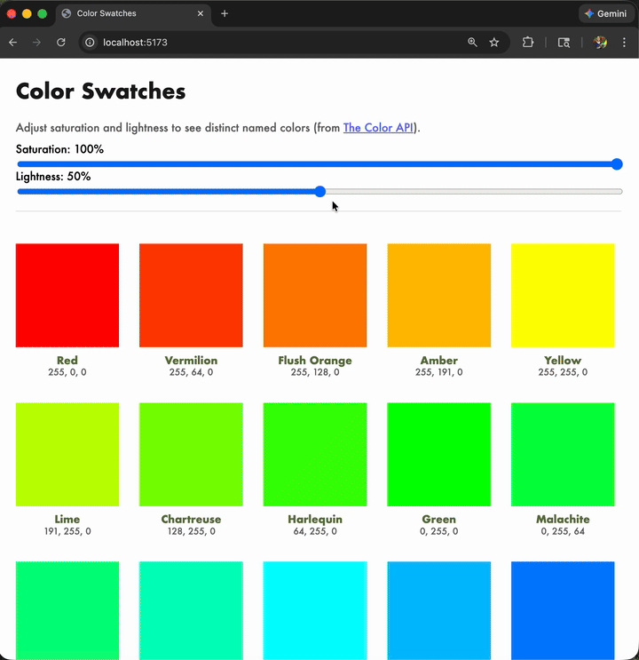

# Color Swatches

A grid of HSL color swatches that takes user inputs for **saturation (S)** and **lightness (L)** and renders one swatch per distinct color name returned by [The Color API](https://www.thecolorapi.com/) for those S and L values. Each swatch shows the color, its name, and RGB values; clicking a swatch opens a detail page.

## Demo



## How to run locally

1. **Prerequisites:** Node.js (v18+) and [pnpm](https://pnpm.io/) (e.g. `npm install -g pnpm`).
2. **Install dependencies and start the dev server:**
   ```bash
   pnpm install
   pnpm dev
   ```
3. Open **http://localhost:5173** in your browser.
4. **Run tests:** `pnpm test` (runs type-check, lint, format, and specs).

## Design choices (summary)

We prioritized predictable loading behavior and a small number of API calls without sacrificing coverage of distinct names. S and L are debounced so we don’t request on every slider tick; we sample the hue circle at fixed steps and deduplicate by name (the API has no batch endpoint, so the only lever is step size). We keep the previous grid on screen while new data loads and show a linear spinner over the controls whenever a request is in flight, so the UI stays responsive and it’s clear when work is happening.

The stack (React, Jotai, TanStack Query, TanStack Router) keeps server state in queries and UI/route state in atoms and the URL. The detail page uses query params so links are shareable; list and detail both use the same query/atom patterns for consistency and cacheability.

**Submission:** Share the repository link with **matt@akk.io** and **nadia@akk.io** per the assessment instructions.

---

### Creating the demo GIF

From the project root, with [ffmpeg](https://ffmpeg.org/) installed (e.g. `brew install ffmpeg`), convert a screen recording to an animated GIF and save it as `assets/screen-recording.gif`:

```bash
# Replace INPUT.mov with your recording path (e.g. from Desktop)
ffmpeg -i "INPUT.mov" -vf "fps=10,scale=720:-1:flags=lanczos,split[s0][s1];[s0]palettegen[p];[s1][p]paletteuse" -loop 0 assets/screen-recording.gif
```
